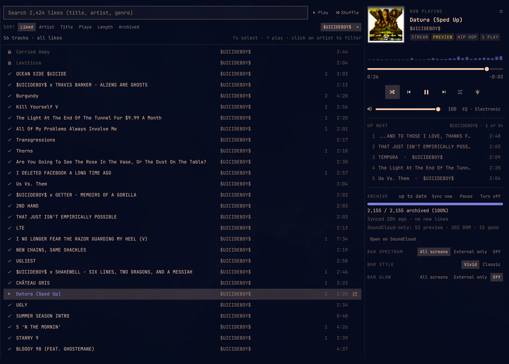

# Deep Shuffle for SoundCloud (Omarchy plugin)

A player for your SoundCloud likes that lives in the Omarchy bar. It pulls your likes into a local library
and plays them with mpv. Searching, shuffling, the EQ and media keys work the same whether a track streams or
is stored locally.

**Its shuffle covers all of your likes, not just the recent ones.** A web player can only shuffle what the page
has loaded, and loading thousands of likes by scrolling is slow, especially on older machines. So shuffling a
big collection in a browser tends to keep replaying your newest likes. deepshuffle keeps your whole likes list
locally, so every shuffle draws from all of it. See [Shuffle](#shuffle-that-covers-all-your-likes).

Optional extras:
- **Archive:** keep local copies of your likes for offline listening. Off by default; see [Archiving](#archiving-optional).
- **Play on another machine:** e.g. a desktop with better speakers, driven from your laptop. See
  [Play on another machine](#play-on-another-machine-optional).

## Shuffle that covers all your likes

Your full likes list is synced into a local database (once a day, and whenever you hit **Sync now**), so shuffle
never depends on what a page happens to have loaded.

- **Every like has the same chance.** The whole list is shuffled up front, so a like from years ago is as likely
  to come up next as one from yesterday.
- **No repeats until you've heard everything.** Shuffle deals your likes like a shuffled deck: each lap plays every
  track once. With repeat on, the next lap is a fresh shuffle.
- **It remembers where you are.** The shuffled order and your place in it are saved, so a restart or reboot
  carries on instead of reshuffling.
- **Shuffle any slice the same way:** one artist, one genre, a search, or only what's stored locally.
- **It's light.** It's just a list of track IDs in memory, so thousands of likes shuffle instantly, even on old
  hardware. Tracks that can't play (DRM, removed from SoundCloud) are skipped automatically.

Turn it on with the shuffle button, `s` in the dropdown, or `deepshuffle shuffle on`.

## What you get

**Pill.** Shows the play state and a scrolling `Artist – Title`, with a thin progress line along the bottom.
On screens narrower than 1600 px the title is capped at `narrowMaxWidth` (80 px), so the bar doesn't run
into the clock.
- Left-click opens the dropdown.
- Middle-click plays or pauses.
- Right-click skips to the next track.
- Scrolling changes the volume.

**Dropdown.**
- Cover art, badges (LOCAL/STREAM, PREVIEW, genre, play count), a scrubber, and shuffle/prev/play/next/repeat.
- A volume slider (the system output, the same knob as your volume keys).
- The next 5 tracks. Click one to jump to it.
- Library status: sync time and, if archiving is on, archive progress with a pause/resume button.
- Links to open the track on SoundCloud, open the artist's buy/download link, or show the file.
- Keys: space plays/pauses, ←/→ seek 10 s, ↑/↓ change volume, n/p go to the next/previous track, s toggles shuffle,
  r cycles repeat, Esc closes.

**Full player** (⤢ in the dropdown, `f`, or `omarchy-shell io.github.papershoes22.deepshuffle expand`):
- **Sidebar:** library views with counts (all, stored locally, streaming, Go+ previews, SoundCloud-only, failed,
  unliked), top genres and top artists. Clicking a genre or artist toggles the filter.
- **Track list:** search (words match title, artist or genre), sort (liked, artist, title, plays, length, archived)
  and status icons (✓ stored locally, cloud = streams, ↓ queued for archive, 30s = preview, lock = DRM, × = gone).
  Clicking a row plays the list as shown, starting at that row. **Play** and **Shuffle** play the whole filtered
  list. Hovering a row shows **Open on SoundCloud** (and **Archive now**, which saves just that track).
- **Now-playing column:** the same as the compact dropdown.
- Keys: type to search, ↑/↓ select, ⏎ play the selection, / focuses search, g toggles the bar glow, f toggles modes.

**Cover-art colors:** the dropdown, full player and screensaver overlay take their accent, a soft background tint
and the border color from the current track's cover, fading over when the track changes. Grey or black-and-white
covers keep the theme's accent. The bar pill always uses the theme.

**Equalizer:** the EQ button next to volume gives 10 bands (31 Hz–16 kHz, ±12 dB) with presets (Flat, Bass,
Treble, Vocal, Loudness, Electronic, Hip-hop). It's applied live and remembered. CLI: `deepshuffle eq [preset] [--band N --gain DB]`.

**Visualizer** (optional, needs `cava`): a spectrum strip in the dropdown and full player, a 5-bar mini spectrum
in the pill, and a full-screen overlay on top of Omarchy's screensaver while music plays. cava only runs while
music is playing. The pill spectrum costs CPU (roughly 20–40% of the shell on two monitors), so the **BAR SPECTRUM**
chips at the bottom of the dropdown choose **All screens**, **External only** (not a laptop's built-in screen) or
**Off** (also `omarchy bar set io.github.papershoes22.deepshuffle pillVisualizer On|External|Off`).

## Install

Needs `mpv`, `yt-dlp` and `ffmpeg`. Optional: `python-gobject` (media keys / MPRIS) and `cava` (visualizer).

    omarchy plugin add https://github.com/papershoes22/omarchy-soundcloud-likes
    P=~/.config/omarchy/plugins/io.github.papershoes22.deepshuffle
    mkdir -p ~/.local/bin ~/.config/systemd/user
    ln -s $P/bin/deepshuffle ~/.local/bin/deepshuffle
    for u in deepshuffle.service deepshuffle-remote.service deepshuffle-sync.service deepshuffle-sync.timer; do
      ln -s $P/systemd/$u ~/.config/systemd/user/$u; done
    deepshuffle config user <your-soundcloud-profile-name>     # the <name> in soundcloud.com/<name>
    systemctl --user daemon-reload && systemctl --user enable --now deepshuffle.service deepshuffle-sync.timer
    systemctl --user start deepshuffle-sync.service             # first sync; takes about 30 s
    omarchy plugin enable io.github.papershoes22.deepshuffle --section right

Your likes must be public on SoundCloud (the default). Nothing here asks for your password or logs in.

Optional hotkeys, for `~/.config/hypr/bindings.lua`:

    o.bind("SUPER + CTRL + M", "Deep Shuffle", "omarchy-shell io.github.papershoes22.deepshuffle toggle")
    o.bind("SUPER + ALT + M", "Deep Shuffle (full player)", "omarchy-shell io.github.papershoes22.deepshuffle expand")

`hypr/deepshuffle.lua` is an optional window rule that floats the full player on a laptop's built-in screen (see the
comment inside for how to load it).

## Settings

    deepshuffle config                     # show them (~/.config/deepshuffle/config.json)
    deepshuffle config user <name>         # whose likes (required)
    deepshuffle config archive on|off      # keep local copies (default off)
    deepshuffle config remote <ssh-host>   # another machine to play on (optional)

The bar widget's own settings (pill title width, visualizer, style, bar glow) are in Omarchy's bar settings.

## What runs in the background

Everything lives in `bin/deepshuffle` (stdlib Python, driving mpv and yt-dlp) and three systemd **user** units.
Nothing needs root.

- `deepshuffle.service`: the player (`mpv --idle` over its JSON IPC socket), the MPRIS server for media keys, the
  visualizer feed (cava, only while playing) and, if enabled, the archive worker.
- `deepshuffle-sync.timer` / `.service`: once a day, fetches your likes list (new likes; unlikes are reconciled weekly).
  **Sync now** in the dropdown runs it right away.
- `deepshuffle-remote.service`: only used for [playing on another machine](#play-on-another-machine-optional).

The panel talks to the daemon over `~/.local/state/deepshuffle/ctl.sock` (JSON lines) and watches
`~/.local/state/deepshuffle/state.json`.

- **Media keys** (play/pause, next, previous) work through MPRIS (`org.mpris.MediaPlayer2.deepshuffle`): Omarchy's
  media bindings and OSD, and `playerctl`, all see it.
- **CLI:** `deepshuffle --help` (play, pause, next, seek, vol, shuffle, repeat, now, queue, eq, sync, export, stats, …).
- **IPC** for hotkeys: `omarchy-shell io.github.papershoes22.deepshuffle open|close|toggle|expand|collapse|playPause|next|prev|stop|sync|togglePlayOn`,
  `… search "<text>"`, `… artist "<name>"` and `… playOn here|remote`.

## Archiving (optional)

Off by default. Your likes stream from SoundCloud, the same way the SoundCloud website plays them.

With `deepshuffle config archive on` (or **Turn on** in the dropdown's library section), the daemon keeps a local copy
of each like for offline listening, in `~/Music/soundcloud/<Artist>/<Title> [<id>].m4a` with the cover art
and tags embedded. It's deliberately gentle:
- one download at a time, with pauses between tracks;
- a 15-minute back-off if SoundCloud rate-limits (HTTP 429);
- it runs at low CPU and IO priority, and never while you've paused it.

It only saves what SoundCloud already streams to you. **DRM-protected tracks and Go+ tracks are never downloaded:**
they're marked as such and stay SoundCloud-only, with a link to the track (and its purchase link, where there is one).
Unliked tracks keep their files and move to the "Unliked" view; deepshuffle never deletes archived files.

Archiving is for your personal offline listening. Check SoundCloud's Terms of Use and respect the artists' wishes
before turning it on. Where an artist offers a download or purchase link, the footer links to it, and that's the
way to support them.

Maintenance:

    deepshuffle stats                 # counts by status
    deepshuffle archive status        # queue counts (JSON)
    deepshuffle archive pause|resume
    deepshuffle archive retry         # requeue tracks that failed 3×
    deepshuffle audit [--fix]         # files vs DB; --fix requeues missing files
    journalctl --user -u deepshuffle -f

## Play on another machine (optional)

If you have a second machine with deepshuffle installed, for example a desktop with good speakers, this one can be its
remote control. `deepshuffle config remote <ssh-host>` (a host from `~/.ssh/config`, with key-based login) adds a
**PLAY ON · Here | <host>** switch at the top of the dropdown (also `t` in the player, or `deepshuffle play-on here|remote`).

On the remote host, the local `deepshuffle` daemon stops and `deepshuffle-remote.service` stands in for it. It relays
`ctl.sock` to the other machine's daemon over one ssh connection, mirrors that machine's `state.json`, sync status
and output volume here, and owns the MPRIS name. So the panel, the pill, the CLI and the media keys all drive the
other machine. The volume slider moves its output, and **Sync now** syncs it. Cover art that isn't in this machine's
library is copied into `~/.cache/deepshuffle/remote-art/`.

**Here** pauses the other machine and brings the local player back. The choice survives logins, because `play-on`
swaps which of the two units starts at login. If the other machine can't be reached, the switch says so, and
**Here** is one click away. Needs python3 on the other machine.

## Files

- `~/.config/deepshuffle/config.json`: settings
- `~/.local/share/deepshuffle/likes.db`: library (SQLite)
- `~/.local/state/deepshuffle/`: live state for the panel (`state.json`, `sync.json`, `play-on.json`, sockets)
- `~/Music/soundcloud/`: local copies, only if archiving is on; exports (`deepshuffle export`) go in `_exports/`

## Uninstall

    systemctl --user stop deepshuffle.service deepshuffle-remote.service deepshuffle-sync.timer
    rm ~/.config/systemd/user/default.target.wants/deepshuffle{,-remote}.service \
       ~/.config/systemd/user/timers.target.wants/deepshuffle-sync.timer 2>/dev/null
    rm ~/.local/bin/deepshuffle ~/.config/systemd/user/deepshuffle{,-remote,-sync}.service \
       ~/.config/systemd/user/deepshuffle-sync.timer 2>/dev/null
    systemctl --user daemon-reload
    omarchy plugin remove io.github.papershoes22.deepshuffle

Then remove any `deepshuffle` hotkeys you added to `~/.config/hypr/bindings.lua`. Your library
(`~/.local/share/deepshuffle/`), settings (`~/.config/deepshuffle/`) and any archived music (`~/Music/soundcloud/`)
are left alone. Delete them only if you really mean to.

## License

MIT, see [LICENSE](LICENSE).
